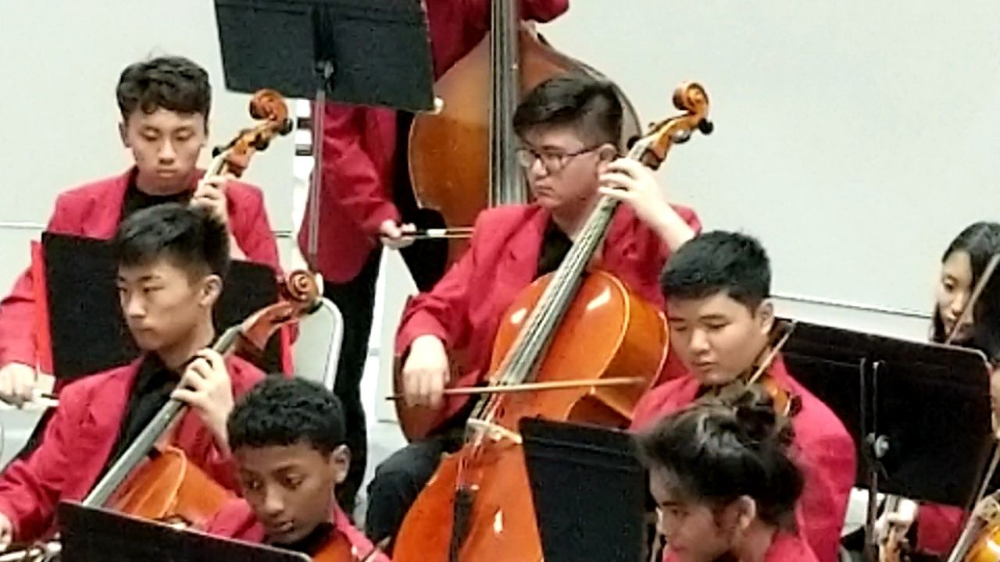

"So class, I have some news ... we unfortunately ... were not one of the schools chosen to perform at Carnegie Hall ... we were instead ...  PERSONALLY INVITED by Carnegie Hall to perform!!!" my music teacher exclaimed excitedly.

It is my sophmore year at Kalani High School. After the annual event "Parade of Orchestras", an event where middle schools and high schools from across Oahu come together at Pearl City Cultural Center and perform their personal selection of songs. It is a non competitive event where each school will get judged and given a grade for their performance. But each school is actually trying to impress scouters from Carnegie Hall who are under-cover in the audience.

So fast forward a couple days, in class, my teacher decides to pull a prank. He starts the class with solemn tone (imagine some sad music playing) "Class, I have some news ... unfortunately, we were not chosen to perform at the Carnegie Hall ... but class, don't worry ... since ... we were actually INVITED to play at the Carnegie Hall!!" my teacher very excitely exclaimed. It is one thing to be chosen as one of the schools to play at the Carnegie Hall. But a completely different thing to have the orchestra personally invited by Carnegie Hall to perform on their stage.

But sadly, a global setback called Covid-19 happened and the trip was eventually canceled due to obvious health concerns.

This was a very humbling experience. However, I believe that just knowing I was a member of an orchestra invited to Carnegie Hall to perform, is a massive accomplishment in itself.
