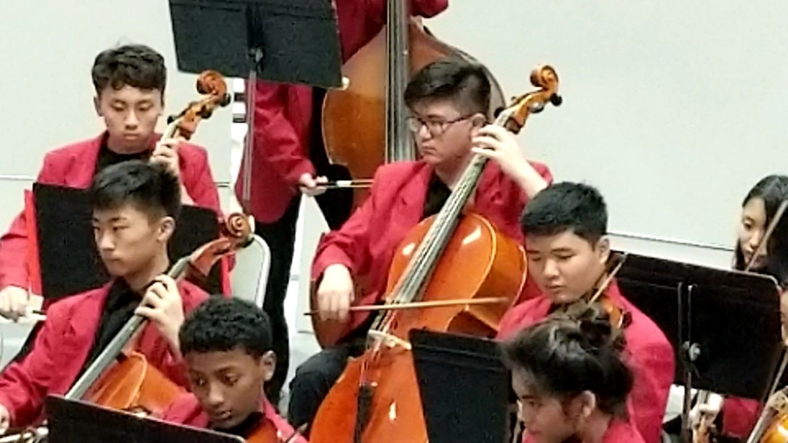

I was a cellist in the school orchestra for a number of years. One of the main things I learned is to be proficient in multi-tasking. During rehearsals and performances, I needed to pay close attention to the conductor, stay in tempo with the conductor, make sure I am in tune with my section, listen to the other sections for sound cues, read my sheet music, and on top of all these, I had to play each note correctly. Learning from my own mistakes, correcting and improving myself, and at the same time, giving constructive criticisms to my fellow cellists, these are the ways I learned to be a constructive teamplayer in orchestra.

For seven years, my school orchestras performed regularly in our own schools, inter-school concerts, annual events, festive performances in public places, etc. In 2019, my high school orchestra was invited to perform at Carnegie Hall, New York, in April 2021. However, unfortunately, due to the Covid epidemic, the concert was eventually cancelled. 

Being a member in an 60-people orchestra, it was important for me to consistently fine-tune myself and my skills, to be constructive and flexible to work with different individuals. In doing so, we could all enjoy the fruit of our hardwork.
